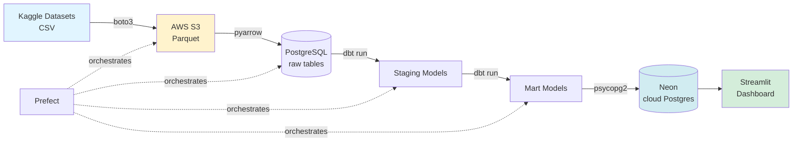

# Medical Supply Chain · Analytics Platform

An end-to-end data engineering project tracking **100K+ medical supply orders** across delivery performance, logistics delays, and payment fraud signals.

<!-- Uncomment once dashboard URL is confirmed -->
<!-- **🔗 Live dashboard → [Click here](https://your-url.streamlit.app)** -->

---

## What this project does

This platform ingests raw order, shipment, and payment data from multiple sources, transforms it through a multi-layer pipeline, and serves it as an interactive analytics dashboard — all automated and running in the cloud.

**Business questions it answers:**
- What percentage of medical supply orders are delivered on time?
- Which carriers have the highest delay rates?
- Which payment methods have the highest fraud risk?
- Is delivery performance improving or declining over time?

---

## Architecture



**Data flow:** CSV → S3 (Parquet) → Postgres → dbt (staging → marts) → Neon → Streamlit
**Orchestration:** Prefect · **Data quality:** 20 dbt tests, all passing

---

## Tech stack

| Layer | Tool |
|-------|------|
| Ingestion | Python, boto3 |
| Storage | AWS S3, Parquet |
| Transformation | dbt Core, PostgreSQL |
| Orchestration | Prefect |
| Data quality | dbt tests (20 passing) |
| Cloud database | Neon PostgreSQL |
| Dashboard | Streamlit, Plotly |
| Version control | Git, GitHub |

---

## Datasets

| Dataset | Source | Rows |
|---------|--------|------|
| E-commerce orders | Olist (Kaggle) | 99,441 |
| Payment fraud | IEEE-CIS (Kaggle) | 50,000 |
| Synthetic patients | Synthea | 117 |
| Patient encounters | Synthea | 8,316 |

---

## dbt models

```
staging/
├── stg_orders.sql           # Clean order data
├── stg_payments.sql         # Clean payment data
└── stg_fraud.sql            # Clean fraud signals

marts/
├── mart_order_fulfillment.sql   # Delivery status per order
├── mart_shipment_delays.sql     # Late orders categorized
└── mart_fraud_signals.sql       # Fraud rate by card type
```

**Data quality:** 20 dbt tests covering uniqueness, not_null, and accepted values — all passing.

```bash
cd transform/medical_supply
dbt test
```

---

## Pipeline orchestration

The full pipeline runs automatically via Prefect:

```
upload_to_s3 → load_to_postgres → dbt run
```

---

## Dashboard features

- 5 KPI metrics with trend indicators
- Interactive date range filter
- Delivery status toggle buttons
- Stacked bar chart — order volume by week
- Donut chart — delivery breakdown
- Horizontal bar chart — delay severity analysis
- Color-coded fraud rate by card type
- Monthly on-time rate trend with 80% target line
- Key business insights panel
- Raw data expander

---

## Engineering decisions

A few choices worth calling out, because "why not X" is a question worth answering up front.

**Prefect over Airflow.** Airflow is the industry default, but it doesn't run natively on Windows and the WSL workarounds added friction for what's fundamentally a three-task DAG. Prefect's Python-native flows made orchestration a single file instead of a Docker project.

**Streamlit over Metabase.** Metabase is the standard BI tool, but Streamlit lets the dashboard live in the same repo as the pipeline, with the same Python dependencies, deployed from the same CI. For a portfolio project, one-click deploy wins.

**Neon for cloud Postgres.** The dashboard needs a database the public internet can reach. Neon's serverless Postgres has a free tier, branching, and scales to zero — cheaper than RDS for this workload and faster to set up.

**Parquet instead of CSV in S3.** Columnar format means downstream reads pull only the columns they need. Smaller files, faster loads, cheaper S3 scans.

---

## How to run locally

```bash
git clone https://github.com/shrutiborkar13/medical-supply-analytics
cd medical-supply-analytics
python -m venv venv
venv\Scripts\activate
pip install -r requirements.txt

# Add your credentials to .env file
# Run the pipeline
python orchestration/pipeline_flow.py

# Run dbt transformations and tests
cd transform/medical_supply
dbt run
dbt test

# Launch dashboard
cd ../..
streamlit run dashboard/app.py
```

---

## Project structure

```
medical-supply-analytics/
├── dashboard/
│   └── app.py                  # Streamlit dashboard
├── ingestion/
│   ├── upload_to_s3.py         # CSV → S3 Parquet
│   ├── load_to_postgres.py     # S3 → PostgreSQL
│   └── upload_to_neon.py       # Local → Neon cloud
├── transform/
│   └── medical_supply/         # dbt project
│       └── models/
│           ├── staging/        # stg_* models + tests
│           └── marts/          # mart_* models + tests
├── orchestration/
│   └── pipeline_flow.py        # Prefect pipeline
└── requirements.txt
```

---

## Future work

- **CDC ingestion** via Debezium for near-real-time updates (currently batch)
- **CI/CD** — GitHub Actions to run `dbt test` on every PR

---

*Built by Shruti Borkar · [LinkedIn](https://linkedin.com/in/shrutiborkar)*